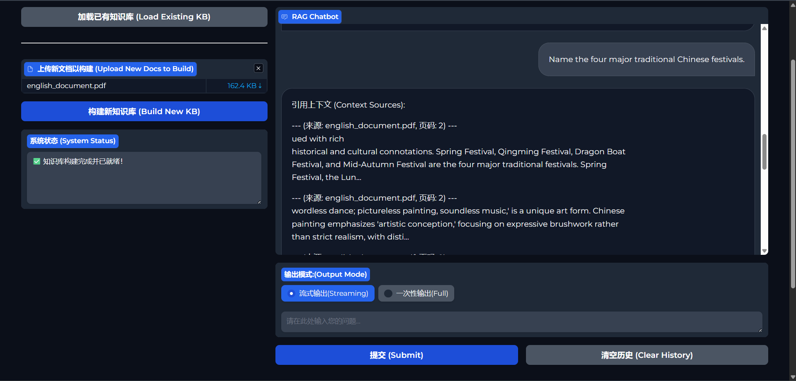
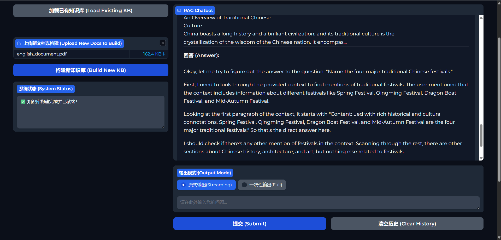

# RAG_Mini
---

# Enterprise-Ready RAG System with Gradio Interface

This is a powerful, enterprise-grade Retrieval-Augmented Generation (RAG) system designed to transform your documents into an interactive and intelligent knowledge base. Users can upload their own documents (PDFs, TXT files), build a searchable vector index, and ask complex questions in natural language to receive accurate, context-aware answers sourced directly from the provided materials.

The entire application is wrapped in a clean, user-friendly web interface powered by Gradio.




## ✨ Features

-   **Intuitive Web UI**: Simple, clean interface built with Gradio for uploading documents and chatting.
-   **Multi-Document Support**: Natively handles PDF and TXT files.
-   **Advanced Text Splitting**: Uses a `HierarchicalSemanticSplitter` that first splits documents into large parent chunks (for context) and then into smaller child chunks (for precise search), respecting semantic boundaries.
-   **Hybrid Search**: Combines the strengths of dense vector search (FAISS) and sparse keyword search (BM25) for robust and accurate retrieval.
-   **Reranking for Accuracy**: Employs a Cross-Encoder model to rerank the retrieved documents, ensuring the most relevant context is passed to the language model.
-   **Persistent Knowledge Base**: Automatically saves the built vector index and metadata, allowing you to load an existing knowledge base instantly on startup.
-   **Modular & Extensible Codebase**: The project is logically structured into services for loading, splitting, embedding, and generation, making it easy to maintain and extend.

## 🏛️ System Architecture

The RAG pipeline follows a logical, multi-step process to ensure high-quality answers:

1.  **Load**: Documents are loaded from various formats and parsed into a standardized `Document` object, preserving metadata like source and page number.
2.  **Split**: The raw text is processed by the `HierarchicalSemanticSplitter`, creating parent and child text chunks. This provides both broad context and fine-grained detail.
3.  **Embed & Index**: The child chunks are converted into vector embeddings using a `SentenceTransformer` model and indexed in a FAISS vector store. A parallel BM25 index is also built for keyword search.
4.  **Retrieve**: When a user asks a question, a hybrid search query is performed against the FAISS and BM25 indices to retrieve the most relevant child chunks.
5.  **Fetch Context**: The parent chunks corresponding to the retrieved child chunks are fetched. This ensures the LLM receives a wider, more complete context.
6.  **Rerank**: A powerful Cross-Encoder model re-evaluates the relevance of the parent chunks against the query, pushing the best matches to the top.
7.  **Generate**: The top-ranked, reranked documents are combined with the user's query into a final prompt. This prompt is sent to a Large Language Model (LLM) to generate a final, coherent answer.

```
[User Uploads Docs] -> [Loader] -> [Splitter] -> [Embedder & Vector Store] -> [Knowledge Base Saved]

[User Asks Question] -> [Hybrid Search] -> [Get Parent Docs] -> [Reranker] -> [LLM] -> [Answer & Sources]
```

## 🛠️ Tech Stack

-   **Backend**: Python 3.9+
-   **UI**: Gradio
-   **LLM & Embedding Framework**: Hugging Face Transformers, Sentence-Transformers
-   **Vector Search**: Faiss (from Facebook AI)
-   **Keyword Search**: rank-bm25
-   **PDF Parsing**: PyMuPDF (fitz)
-   **Configuration**: PyYAML

## 🚀 Getting Started

Follow these steps to set up and run the project on your local machine.

### 1. Prerequisites

-   Python 3.9 or higher
-   `pip` for package management

### 2. Create a `requirements.txt` file

Before proceeding, it's crucial to have a `requirements.txt` file so others can easily install the necessary dependencies. In your activated terminal, run:

```bash
pip freeze > requirements.txt
```
This will save all the packages from your environment into the file. Make sure this file is committed to your GitHub repository. The key packages it should contain are: `gradio`, `torch`, `transformers`, `sentence-transformers`, `faiss-cpu`, `rank_bm25`, `PyMuPDF`, `pyyaml`, `numpy`.

### 3. Installation & Setup

**1. Clone the repository:**
```bash
git clone https://github.com/YOUR_USERNAME/YOUR_REPOSITORY_NAME.git
cd YOUR_REPOSITORY_NAME
```

**2. Create and activate a virtual environment (recommended):**
```bash
# For Windows
python -m venv venv
.\venv\Scripts\activate

# For macOS/Linux
python3 -m venv venv
source venv/bin/activate
```

**3. Install the required packages:**
```bash
pip install -r requirements.txt```

**4. Configure the system:**
Review the `configs/config.yaml` file. You can change the models, chunk sizes, and other parameters here. The default settings are a good starting point.

> **Note:** The first time you run the application, the models specified in the config file will be downloaded from Hugging Face. This may take some time depending on your internet connection.

### 4. Running the Application

To start the Gradio web server, run the `main.py` script:

```bash
python main.py
```

The application will be available at **`http://localhost:7860`**.

## 📖 How to Use

The application has two primary workflows:

**1. Build a New Knowledge Base:**
   -   Drag and drop one or more `.pdf` or `.txt` files into the "Upload New Docs to Build" area.
   -   Click the **"Build New KB"** button.
   -   The system status will show the progress (Loading -> Splitting -> Indexing).
   -   Once complete, the status will confirm that the knowledge base is ready, and the chat window will appear.

**2. Load an Existing Knowledge Base:**
   -   If you have previously built a knowledge base, simply click the **"Load Existing KB"** button.
   -   The system will load the saved FAISS index and metadata from the `storage` directory.
   -   The chat window will appear, and you can start asking questions immediately.

**Chatting with Your Documents:**
   -   Once the knowledge base is ready, type your question into the chat box at the bottom and press Enter or click "Submit".
   -   The model will generate an answer based on the documents you provided.
   -   The sources used to generate the answer will be displayed below the chat window.

## 📂 Project Structure

```
.
├── configs/
│   └── config.yaml         # Main configuration file for models, paths, etc.
├── core/
│   ├── embedder.py         # Handles text embedding.
│   ├── llm_interface.py    # Handles reranking and answer generation.
│   ├── loader.py           # Loads and parses documents.
│   ├── schema.py           # Defines data structures (Document, Chunk).
│   ├── splitter.py         # Splits documents into chunks.
│   └── vector_store.py     # Manages FAISS & BM25 indices.
├── service/
│   └── rag_service.py      # Orchestrates the entire RAG pipeline.
├── storage/                # Default location for saved indices (auto-generated).
│   └── ...
├── ui/
│   └── app.py              # Contains the Gradio UI logic.
├── utils/
│   └── logger.py           # Logging configuration.
├── assets/
│   └── 1.png               # Screenshot of the application.
├── main.py                 # Entry point to run the application.
└── requirements.txt        # Python package dependencies.
```

## 🔧 Configuration Details (`config.yaml`)

You can customize the RAG pipeline by modifying `configs/config.yaml`:

-   **`models`**: Specify the Hugging Face models for embedding, reranking, and generation.
-   **`vector_store`**: Define the paths where the FAISS index and metadata will be saved.
-   **`splitter`**: Control the `HierarchicalSemanticSplitter` behavior.
    -   `parent_chunk_size`: The target size for larger context chunks.
    -   `parent_chunk_overlap`: The overlap between parent chunks.
    -   `child_chunk_size`: The target size for smaller, searchable chunks.
-   **`retrieval`**: Tune the retrieval and reranking process.
    -   `retrieval_top_k`: How many initial candidates to retrieve with hybrid search.
    -   `rerank_top_k`: How many final documents to pass to the LLM after reranking.
    -   `hybrid_search_alpha`: The weighting between vector search (`alpha`) and BM25 search (`1 - alpha`). `1.0` is pure vector search, `0.0` is pure keyword search.
-   **`generation`**: Set parameters for the final answer generation, like `max_new_tokens`.

## 🛣️ Future Roadmap

-   [ ] Support for more document types (e.g., `.docx`, `.pptx`, `.html`).
-   [ ] Implement response streaming for a more interactive chat experience.
-   [ ] Integrate with other vector databases like ChromaDB or Pinecone.
-   [ ] Create API endpoints for programmatic access to the RAG service.
-   [ ] Add more advanced logging and monitoring for enterprise use.

## 🤝 Contributing

Contributions are welcome! If you have ideas for improvements or find a bug, please feel free to open an issue or submit a pull request.

## 📄 License

This project is licensed under the MIT License. See the `LICENSE` file for details.
